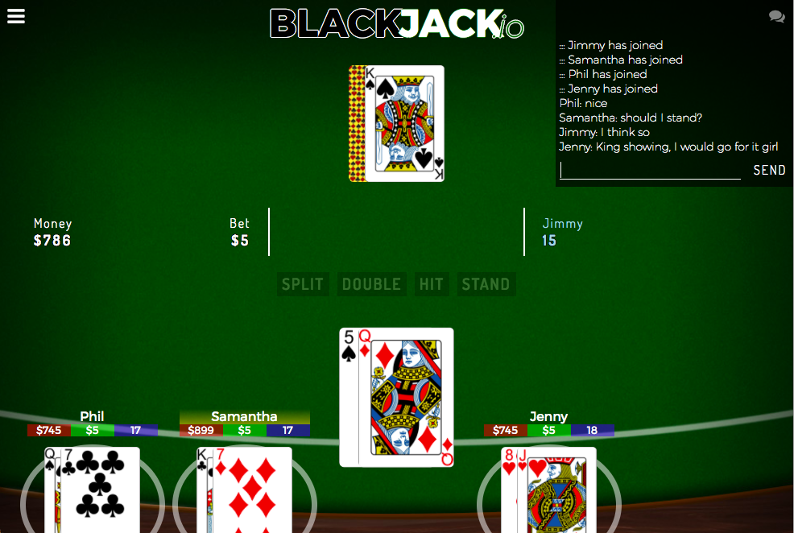
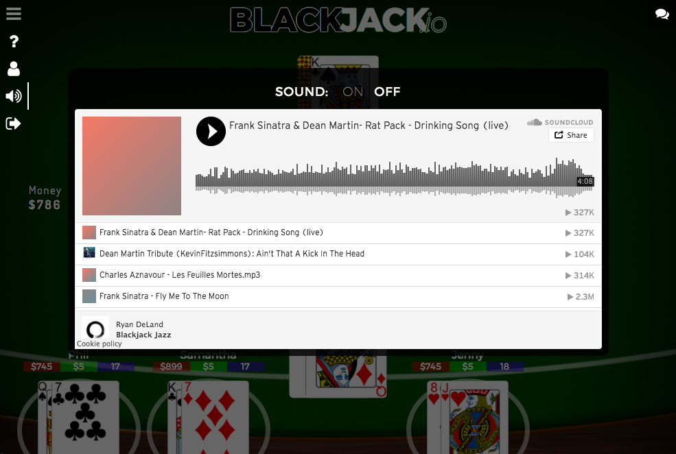
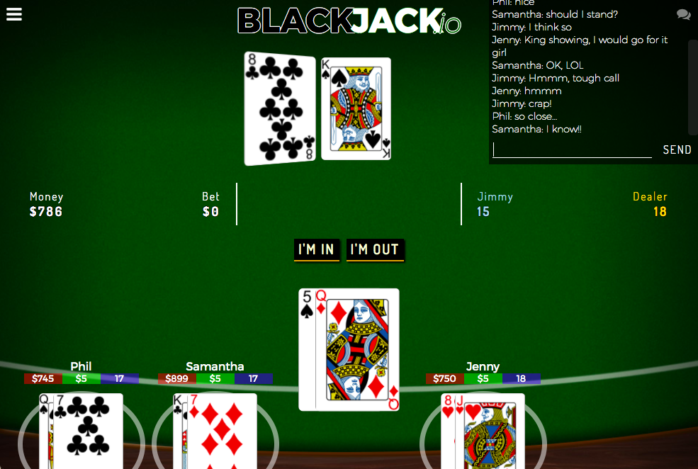
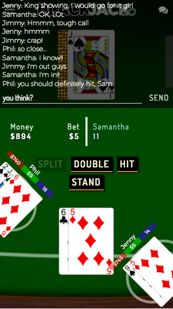
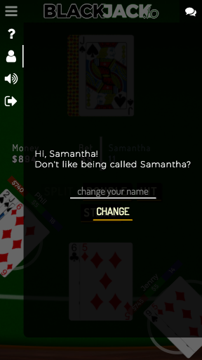

# Blackjack.io

Play it here! ==> [blackjack-io.herokuapp.com/](http://blackjack-io.herokuapp.com/)

## What is Blackjack?

Blackjack, also known as 21, is a card game where players face off against a dealer. The dealer and the players each initially get two cards. The players can only see one of the dealer's cards. The cards are worth face value, except Aces and face cards (J, Q, K), which are 1 or 11 and 10, respectively.

Each player's goal is to get the sum of their cards higher than the sum of the dealer's cards, without that sum going over 21 ('BUST'). To join a game, each player must bet an amount of money.

After the initial two-card deal, if the dealer has a blackjack, meaning their two cards add up to 21 (meaning an ace and a 10/J/Q/K), the game is immediately over and everyone at the table who does not also have a blackjack loses. Players who do have blackjack get only their initial bet back ('PUSH'). If the dealer does not have a blackjack, players who do have blackjack automatically win, and even get paid out 1.5x on top of their original bet!

If neither the dealer nor the player has a blackjack, the player then has up to four options:

'HIT': The player requests additional cards if they want to increase their chances of beating the dealer. If the new card puts the player's total over 21 ('BUST'), their turn is automatically over.
'DOUBLE DOWN': The player doubles their original bet and gets just one additional card. After this, their turn is over, whether or not they 'BUST'.
'SPLIT': If the player's initial two cards have the same value (including 10s and face cards), they can split those two cards into two separate hands, each of which get an extra card. From there, the player plays each split hand separately. This also essentially doubles the player's bet, as each split hand has their own separate bet equal to the player's original bet.
'STAND': When the player is satisfied, and has not gone over 21, they can end their turn.

When each player has ended their turn, if sum of the dealer's hand is less than 17, the dealer will 'HIT' until their hand is worth 17 or higher, at which point, the dealer stands. If the dealer 'BUSTS', the players automatically win.

After the dealer stands, the dealer's hidden card is revealed to the players, and if the sum of the player's hand is higher than the dealer's, the player wins. If they are equal, then it is a tie game, or 'PUSH'. If the dealer's is higher than the player's, the player loses.

## Technical Discussion

This game is a revamping of my earlier Blackjack web browser game that adds socket.io to make it a multiplayer game. This required offloading a lot of game functionality to a simple Node backend to handle the role of the dealer. It also makes heavy use of jQuery, Javascript, and CSS, with a barebones HTML file that is filled in dynamically.

I must admit, implementing 'SPLIT' turned out to be more complicated than I expected, largely because the game was originally built around the assumption that players would only have one hand (essentially an array of Card objects). Splitting necessitated turning the array of objects into an array of arrays of objects, which, in and of itself, is not so bad, but when all of the game logic is built around handling an array of objects, whole functions and sections of code had re-thought to ensure they could handle split hands.

### Notes on Game Structure

In addition to turning this into a multiplayer game, the game also includes card & chip sound effects and an embedded jazz music Soundcloud playlist curated by myself. They are turned off by default.

## The Making of Blackjack.io

This version is the realization two things: following through on what I originally wanted to accomplish if I had more time for my original Blackjack game (implementing splitting and doubling down, adding music and sound, responsive design), as well as fulfilling something I wanted to do when I first learned socket.io, creating a multiplayer game, which I did as part of a group project in Grandmaster.io and now, finally, brought to Blackjack.

## Opportunities for Future Growth

I still have not implemented insurance, where the player can put down some money when the dealer is showing an ace, which indicates a possible blackjack. In the event of a blackjack, the player would then get their money back. I'd also like to implement a visual representation of the player's money as stacks of chips, which would just require getting some chip image assets and DOM manipulating the crap out of them.

I'd also like to re-think the visual design of the game a bit more.

And, of course, there are still some bugs that I'll be ironing out.
